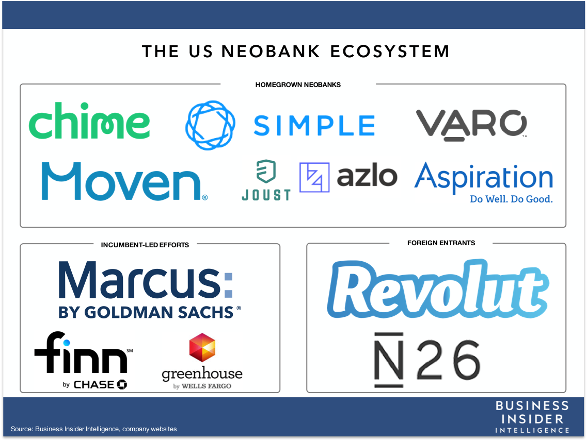

# sounds of 2001: chime

### incorporated
2013
### founders
- Chris Britt
- Ryan King
### story about origin

### funding
the company has thus far been funded privately via venture captial funds.  in March of 2020, they completed their Series E financing which took them to a total life to date raise of roughly $1 billion.

## industy landscape

### why the opportunity exists
Chime is an example of a neobank or challenger bank.  Since the financial crisis over a decade ago, there have been numerous attempts to entice business away from the traditional banking platforms of the majors such as JPMorgan and Wells Fargo to a completely digitized world of banking that offers the same consumer banking services all online and without all the fees.  As the founder of Aspiration, a competitor of Chime, Andrei Cherny says...

>In consumer banking, you have what is one of the largest industries in the United States, in terms of profits, and at the same time one of the least disrupted industries, and the most unpopular with consumers.

### target demographic defines the product
The target demographic is obviously going to begin with more tech savy consumers such as millenials, but the potential reach is really the entire retail banking industry including all deposits, credit cards, and other traditional banking services.  It is an industry with trillions of dollars of market share available for disruption.  Avoiding the physical overhead costs of the traditional retail banking model, neobanks like Chime can offer the same services without all the fees.  In a nutshell, the value proposition is the accessibility and convenience of an existing product elsewhere at a cheaper cost (essentially free).

### plenty of competition, but plenty of available market share
Below is a diagram of the neobank space in the United States per Business Insider that are competing or will be competing in the same space as Chime.  Some like N26 are just beginning their operations in the US, but as a company already dwarf the size of Chime in terms of users because of the advanced growth of this particular space in Europe.  Not included below would also be the traditional big banks of Wall Street already pivoting to the online based model.  However, it is a space with plenty of market share available that can be acquired by establishing trust in an industry with wary consumers.

- 

## addendum
- https://www.investopedia.com/chime-bank-review-4846500
- https://www.chime.com/
- https://www.chime.com/press/
- https://pitchbook.com/profiles/company/97267-96#overview
- https://www.usatoday.com/story/money/2018/09/20/wells-fargo-chime-empower-banks-battle-millennial-accounts/1358176002/
- https://www.nytimes.com/2018/11/20/technology/finance-start-ups-neo-banks.html
- https://medium.com/crowdfundup/what-is-a-neo-bank-and-how-are-they-disrupting-traditional-banking-models-3c1b2fa5b8e1