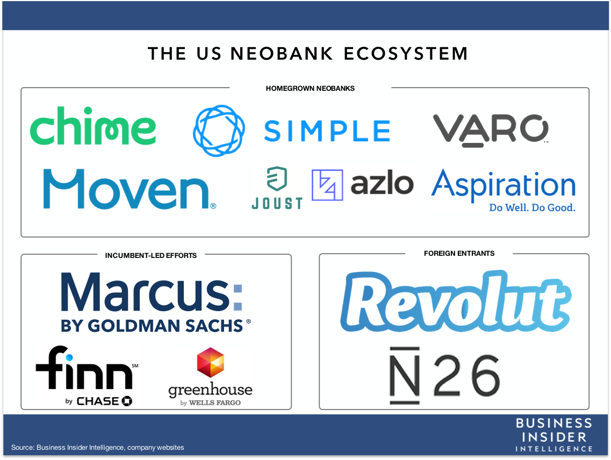

# sounds of 2001: chime

### incorporated
2013

### founders
- Chris Britt
- Ryan King

### funding
the company has thus far been funded privately via venture captial funds.  in September 2020, they completed their Series F financing which took them to a total life to date raise of roughly $1.5 billion.

## business acitivites
Chime operates as a white-label with The Bancorp Bank providing the actual banking services.  in other words, Chime acts as an online interface between the consumer and the services of an FDIC insured banking partner instead of itself working to get a banking charter.  through this arrangment, Chime provides savings and checking services along with debit card functionality.

in addition, it also relies on third party vendors such as payment processor Gelileo to achieve its functionality.  reliance on third party vendors has cause issues in terms of its platform's performance.

Chime utilizes a mobile app built with React Native or a JavaScript library for building user interfaces.

## industy landscape

### why the opportunity exists
Chime is an example of a neobank or challenger bank.  since the financial crisis over a decade ago, there have been numerous attempts to entice business away from the traditional banking platforms of the majors, such as JPMorgan and Wells Fargo, to a completely digitized world of banking that offers the same consumer banking services all online and without all the fees.  as the founder of Aspiration, a competitor of Chime, Andrei Cherny says...

>in consumer banking, you have what is one of the largest industries in the United States, in terms of profits, and at the same time one of the least disrupted industries, and the most unpopular with consumers.

### target demographic defines the product
the target demographic is obviously going to begin with more tech savy consumers such as millenials, but the potential reach is really the entire retail banking industry including all deposits, credit cards, and other traditional banking services.  it is an industry with hundred of billions to trillions of dollars of market share available for disruption.  avoiding the physical overhead costs of the traditional retail banking model, neobanks like Chime can offer the same services without all the fees.  in a nutshell, the value proposition is the accessibility and convenience of an existing product elsewhere at a cheaper cost (essentially free in Chime's case).

### plenty of competition, but plenty of available market share
below is a diagram of the neobank space in the United States, per Business Insider, and the companies that are competing or will be competing with Chime.  some like N26 are just beginning their operations in the US, but have already had similar success to Chime in Europe.  not included below would also be the traditional big banks of Wall Street already pivoting to the online based model.  however, it is a space with plenty of market share available that can be acquired by establishing trust in an industry with wary consumers.

## results
Chime is still in the generating revenue stage, but growing quickly.  as of February 2020, Chime was up to 8 million accounts.  this is very impressive growth considering it had 1 million customers signed up as of 2018.  most of its market share, according to CEO Chriss Britt, is coming from the big banks.  with its latest Series F funding, Chime is currently valued at $14.5 billion.  this is up from $5.8 billion in December 2019 and $1.5 billion in March 2019.

### recommendations
Chime has a clearly defined product platform which can continue to grow as it builds out its functionality to offer the complete suite of banking services at a fraction of the cost.  as it grows, it is of the uptmost importance it protects its reputation as a trusted banking services provider.  in a space that is about grabbing market share, keeping trust is of the uptmost importance.  it cannot have repeated instances where its product went on outage and failed to perform like in October 2019.  in this case, the outage was due to reliance on a third party vendor.

to avoid future outages, I think Chime needs to seriously consider lessening its reliance on third party vendors for its functionality and develop those same processes in house.  while this would require extensive cost, given the immense competition in this space, any future performance issues could seriously impede the incredible growth Chime has been able to sustain over the past two years.  now that Chime has established market share that has continued to grow its immense ability to raise capital, now is the time to look to invest in development to remove its reliance on third party vendors.

## addendum
- https://www.investopedia.com/chime-bank-review-4846500
- https://www.chime.com/
- https://www.chime.com/press/
- https://pitchbook.com/profiles/company/97267-96#overview
- https://techcrunch.com/2020/09/18/chime-adds-485m-at-a-14-5b-valuation-claims-ebitda-profitability/
- https://wallethacks.com/chime-bank-review/
- https://www.nytimes.com/2018/11/20/technology/finance-start-ups-neo-banks.html
- https://www.businessinsider.com/current-surpasses-1-million-accounts-2020-6
- https://techcrunch.com/2019/07/11/n26-launches-its-challenger-bank-in-the-u-s/
- https://www.cnbc.com/2019/10/17/digital-bank-chime-goes-dark-for-millions-of-customers.html
- https://www.builtinsf.com/job/engineer/mobile-software-engineer/3450
- https://www.businessinsider.com/chime-cracks-8-million-account-milestone-2020-2

